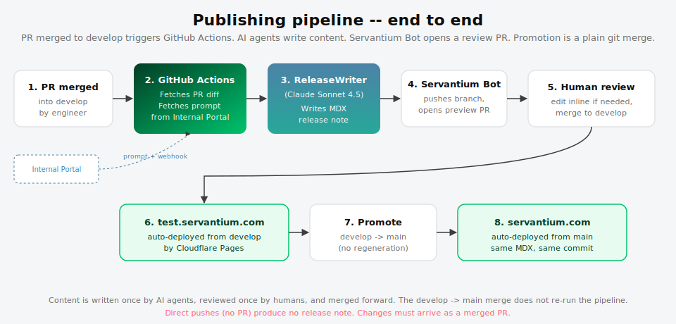
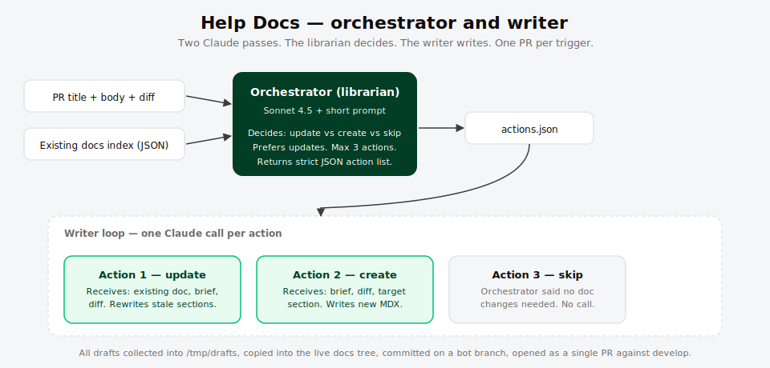
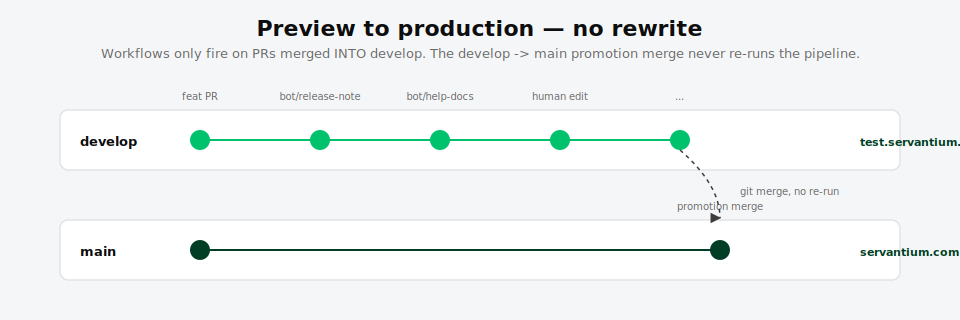

# Servantium Publishing Pipeline

Automated release notes and help docs, written by AI agents, reviewed by humans, promoted by git merge.

This folder is the source of truth for how the pipeline works. If the behaviour ever drifts from what's written here, fix the docs or fix the code -- don't let them diverge.

---

## Who does what

Every actor in the pipeline has a single, named role. If you're reading a workflow log or a commit and wondering "who did this?", the table below is the answer.

| Actor | What it is | Role |
|-------|-----------|------|
| **GitHub Actions** | Compute platform | Runs the YAML workflow files. Orchestrates everything. Makes no content decisions. |
| **Servantium Bot** | GitHub App identity | Authenticates git push and PR creation. Commits show as `servantium-bot[bot]`. Makes no decisions -- it is just the identity the workflow uses to push code and open PRs. Created via github.com/organizations/servantium/settings/apps. Secrets: `SERVANTIUM_BOT_APP_ID` + `SERVANTIUM_BOT_PRIVATE_KEY`. |
| **ReleaseWriter** | AI agent (Claude Sonnet 4.5) | The brain behind release notes. Reads the PR diff and context, writes the MDX release note. Its system prompt lives in the Internal Portal's agents table and is fetched at run start. Editable from /agents -- changes go live on the next workflow run with no redeploy. |
| **Help Docs Orchestrator** | AI agent (Claude Sonnet 4.5) | Decides which help docs need updating based on the PR diff. Returns a JSON action list. Prompt also lives in the portal agents table. |
| **Help Docs Writer** | AI agent (Claude Sonnet 4.5) | Writes or updates individual MDX docs based on the Orchestrator's action list. One Claude call per action. Prompt also lives in the portal agents table. |
| **Internal Portal** | test.internal.servantium.com | Hosts the /releases console, the /agents page for editing prompts, and a webhook endpoint. Workflows fetch prompts from here and POST events back. |
| **GITHUB_TOKEN** | Default Actions token | Read-only: fetches PR metadata and diffs. Does not push code or open PRs (Servantium Bot handles that). |

---

## TL;DR

1. A PR merges into the active test branch (currently `feature/astro-prototype`, soon `develop`).
2. GitHub Actions runs `release-notes.yml` (which calls **ReleaseWriter**) and `help-docs.yml` (which calls **Help Docs Orchestrator** then **Help Docs Writer**).
3. **Servantium Bot** pushes a bot branch and opens a preview PR back into the same base branch.
4. A human reviews, edits inline if needed, and merges.
5. `test.servantium.com` updates immediately (Cloudflare Pages auto-deploys from the test branch).
6. Later, when the test branch is merged into `main`, production updates. **The pipeline does not re-run.** Content is written once and reused across environments.

> **Stealth releases.** A direct push to `develop` (or any branch merge that is not a PR) will not trigger the pipeline. No PR means no release note, no doc updates. Changes must arrive as a merged PR to trigger the pipeline. If you push directly, that is a "stealth release" and you will need to manually create any release notes or doc updates.

> **Branch state (2026-04-15):** The pipeline currently watches `feature/astro-prototype` AND `develop`. When the astro prototype merges to main in ~2 weeks, drop `feature/astro-prototype` from the `branches:` list in both workflow files.



---

## File map

```
.github/
  workflows/
    release-notes.yml          # Workflow A -- release notes (calls ReleaseWriter)
    help-docs.yml              # Workflow B -- help docs (calls Help Docs Orchestrator + Writer)
  scripts/
    claude-run.mjs             # Shared Anthropic SDK runner
    docs-index.mjs             # Emits an index of existing help docs
    help-docs-writer.mjs       # Iterates action list, calls Help Docs Writer once per action

docs/publishing-pipeline/
  README.md                    # This file
  ROADMAP.md                   # Workflow C (screenshots) + Workflow D (linting)
  images/                      # SVG diagrams
```

> **Prompts live in the portal, not in the repo.** The `.github/claude-prompts/` directory from earlier iterations is no longer the source of truth. Both workflow files fetch the live prompt from the Internal Portal at run start. To change what ReleaseWriter or the Help Docs agents produce, edit the prompt on the /agents page at test.internal.servantium.com. The change goes live on the next workflow run with no redeploy.

---

## Installation -- one-time setup

### 1. Repository secrets

Go to **Settings > Secrets and variables > Actions > New repository secret** on the `servantium-website` repo and add:

| Secret | Value |
|--------|-------|
| `ANTHROPIC_API_KEY` | A production-tier Anthropic key with Sonnet 4.5 access |
| `SERVANTIUM_BOT_APP_ID` | The App ID of the Servantium Bot GitHub App (from github.com/organizations/servantium/settings/apps) |
| `SERVANTIUM_BOT_PRIVATE_KEY` | The private key (.pem) for the Servantium Bot GitHub App |

**GITHUB_TOKEN** is provided automatically by Actions -- no action needed. It is read-only and used only to fetch PR metadata and diffs. All write operations (pushing branches, opening PRs) go through **Servantium Bot**.

### 2. Workflow permissions

On the same repo, go to **Settings > Actions > General > Workflow permissions** and ensure:

- **Read and write permissions** is selected
- **Allow GitHub Actions to create and approve pull requests** is checked

Without this, Servantium Bot cannot push branches or open PRs.

### 3. Bot identity

**Servantium Bot** is a GitHub App, not a human or a generic machine user. It was created at github.com/organizations/servantium/settings/apps. Commits authored by the workflow show as `servantium-bot[bot]` in the git log. The App provides:

- A distinct identity in the commit log (not "github-actions[bot]")
- Fine-grained permissions scoped to only the repos it needs
- No personal access token to rotate -- the private key authenticates via JWT

The workflow generates an installation token from `SERVANTIUM_BOT_APP_ID` + `SERVANTIUM_BOT_PRIVATE_KEY` at the start of each run, uses it for git push and PR creation, and the token expires after one hour.

### 4. Testing safely -- first-run playbook

Before relying on the pipeline for real PRs, do a controlled first run:

1. **Verify permissions from Step 2 above are saved.** This is the #1 first-run failure.
2. Go to **Actions > Release Notes (preview) > Run workflow**
3. Pick `feature/astro-prototype` as the branch, enter a recently merged PR number, click Run
4. Watch the run. Expected outcome: a new PR appears titled `docs: release notes draft for #NNN` targeting `feature/astro-prototype`, authored by `servantium-bot[bot]`
5. **Do not merge it.** Open it, read the MDX, verify the voice and frontmatter look right, then close it
6. Repeat for **Help Docs (preview)** against a PR that actually touches user-facing functionality

Safety guarantees baked in:

- **Nothing auto-merges.** A human must click merge. If ReleaseWriter or Help Docs Writer produces garbage, close the PR and nothing ever lands.
- **Servantium Bot PRs skip the workflow** (the `if:` guard checks `user.login != 'servantium-bot[bot]'`), so bot PRs cannot loop into more bot PRs.
- **Drafts only touch `src/content/docs/help/**` + release notes.** Nothing edits layouts, components, or config.
- **The Anthropic call has 3 retries with exponential backoff**, so one transient 500 doesn't fail the run.
- **Per-call token cap of 2048** keeps runaway spend impossible. Realistic cost: ~$0.02 per run.
- **If the first run fails**, the most likely cause is workflow permissions (Step 2) or `ANTHROPIC_API_KEY` missing/invalid. Read the failed step log; it will tell you exactly which.

### 5. Branch protection (recommended)

On `main`, require:
- PR review before merge
- Status checks passing

This means the `develop -> main` promotion merge is a deliberate act, not an accident.

---

## Workflow A -- Release Notes

### Triggers

| Trigger | When it fires |
|---------|---------------|
| `pull_request` closed | Any PR merged into `develop` (not Servantium Bot PRs, not closed-without-merge) |
| `workflow_dispatch` | Manual run via the Actions tab, with a PR number |
| `repository_dispatch` | Cross-repo ping from the app repo (see "Hooking into app releases" below) |

> **Direct pushes are invisible.** If someone pushes directly to `develop` without a PR, no release note is generated. This is by design: the pipeline needs a PR to read the diff and context from.

### What it does

1. **GitHub Actions** checks out the website repo
2. **GitHub Actions** fetches the merged PR's title, body, and diff via `GITHUB_TOKEN` (truncated to 50k chars)
3. **GitHub Actions** fetches the live ReleaseWriter system prompt from the **Internal Portal** (`GET /api/agents/release-writer/prompt`)
4. **GitHub Actions** calls **ReleaseWriter** (Claude Sonnet 4.5) with the fetched prompt and the PR context
5. ReleaseWriter returns the MDX content
6. **GitHub Actions** writes the MDX to `src/content/docs/help/release-notes/YYYY-MM-DD-<slug>.mdx`
7. **GitHub Actions** uses **Servantium Bot** credentials to push a bot branch (`bot/release-note-<pr#>`) and open a PR against `develop`
8. **GitHub Actions** POSTs a run event to the **Internal Portal** webhook (`POST /api/releases/webhook`) so the /releases console shows the run in real-time

### Portal integration

The workflow fetches the ReleaseWriter prompt from the Internal Portal at the start of every run. This means:

- Editing the prompt on the /agents page at test.internal.servantium.com goes live on the next workflow run
- No code change or redeploy needed to tweak the tone, format, or rules
- The /releases console on the portal shows every run, its status, the PR it created, and the MDX it generated

### Hooking it into Max's releases

Three options, pick one or stack them:

**Option A -- trigger on every merged website PR (default, already wired).** Every PR that lands on `develop` produces a note. Good while the pipeline is new -- you see every run, you catch failures early.

**Option B -- trigger only on GitHub Releases from the website repo.** Edit `release-notes.yml` to add:

```yaml
on:
  release:
    types: [published]
```

Then whenever Max publishes a Release on the website repo, GitHub Actions fires and ReleaseWriter writes a note for that release. Skip the PR triggers entirely if you prefer fewer, batched notes.

**Option C -- cross-repo trigger from the app repo (Max's day-to-day).** In the `servantium-app` repo, add a workflow that fires when Max tags a new app version:

```yaml
# In servantium-app/.github/workflows/notify-website.yml
name: Notify website on release
on:
  release:
    types: [published]
jobs:
  dispatch:
    runs-on: ubuntu-latest
    steps:
      - uses: peter-evans/repository-dispatch@v3
        with:
          token: ${{ secrets.WEBSITE_REPO_TOKEN }}   # PAT with repo scope on servantium-website
          repository: servantium/servantium-website
          event-type: app-release
          client-payload: |
            {
              "version": "${{ github.event.release.tag_name }}",
              "notes": ${{ toJson(github.event.release.body) }},
              "diff": ""
            }
```

Max creates a PAT with `repo` scope on the website repo, stores it as `WEBSITE_REPO_TOKEN` on the app repo. Every app release then lands as a draft release note on the website.

### Prompt editing

To change what ReleaseWriter produces (tone, length, format, badge mapping):

1. Go to test.internal.servantium.com/agents
2. Find the ReleaseWriter agent
3. Edit the system prompt
4. Save. The next workflow run picks up the change automatically.

Key rules in the current prompt:
- Customer-facing voice, not engineering
- 180 words max
- Grove components only (`import { Aside } from '@/theme/grove/components';`) -- never Starlight
- Badge variant map: Feature = success, Fix = caution, Improvement = note, Internal = note

### How to run it manually

Actions tab > **Release Notes (preview)** > **Run workflow** > enter a PR number > **Run workflow**.

Use this to re-draft a note for an older PR, or to generate a note for a PR that the automated trigger missed.

---

## Workflow B -- Help Docs (Help Docs Orchestrator + Help Docs Writer)



### Why two agents

A single prompt trying to "figure out what docs to write AND write them" gets muddled. Splitting the job into two Claude calls, each with its own agent identity, keeps each prompt focused and short:

- **Help Docs Orchestrator** (the decision-maker). Receives the PR diff and a machine-readable index of every existing help doc (title, path, description). Decides which docs are stale and need updates, whether any net-new docs are needed, or whether the change is purely internal and no doc action is required. Returns strict JSON.
- **Help Docs Writer** (the author). Receives one action at a time, along with the existing doc content (for updates) or a blank slate (for creates). Rewrites or writes the MDX. Never sees the full docs library -- just the one doc it's editing plus enough context to write well.

### Why this beats "regenerate from scratch every time"

- **Updates preserve history.** Help Docs Writer sees the existing doc and rewrites only the stale sections. Git diffs stay reviewable.
- **Creates stay rare.** Help Docs Orchestrator is told to prefer updates, so the docs library doesn't bloat.
- **Each prompt stays short.** No single prompt has to hold "all docs + diff + style guide + output format."
- **Observability.** The intermediate `actions.json` is a readable, diffable artifact. If Help Docs Orchestrator made a bad call, you can see exactly which action went wrong.

### Trigger

Same as Workflow A: PR merged into `develop` (skip Servantium Bot PRs), plus manual `workflow_dispatch`.

### Flow

1. **GitHub Actions** builds the docs index. `docs-index.mjs` walks `src/content/docs/help/**/*.mdx`, extracts title + description from frontmatter, and emits JSON.
2. **GitHub Actions** fetches the Help Docs Orchestrator prompt from the **Internal Portal**.
3. **Help Docs Orchestrator** (Claude Sonnet 4.5) receives the docs index + PR context. Output: `/tmp/actions.json`.
4. **Short-circuit.** If `actions.length === 0`, GitHub Actions exits cleanly. No PR opened.
5. **GitHub Actions** fetches the Help Docs Writer prompt from the **Internal Portal**.
6. **Help Docs Writer** (Claude Sonnet 4.5) iterates actions. For each, `help-docs-writer.mjs` builds a context JSON (existing doc body, brief, PR diff) and invokes `claude-run.mjs` once. Each draft is written to `/tmp/drafts/<relative path>.mdx`.
7. **Servantium Bot** pushes a bot branch with all drafts copied into the live docs tree, and opens a single PR against `develop` with a summary of every action for reviewer context.
8. **GitHub Actions** POSTs a run event to the **Internal Portal** webhook.

### How updates to existing docs work

Help Docs Orchestrator decides: "This PR changed the engagement creation flow. The doc at `src/content/docs/help/guides/engagements/creating-engagements.mdx` covers that. Update it."

Help Docs Writer then receives:

```json
{
  "action_type": "update",
  "brief": "Update the 'Add a phase' section to match the new inline editor. The modal approach is gone.",
  "reason": "PR #412 replaces the modal with an inline editor.",
  "existing_doc": "<full current MDX>",
  "diff": "<PR diff>"
}
```

And is told (by the Help Docs Writer prompt on the portal):

> When updating an existing doc: preserve the existing structure and headings you don't need to touch. Rewrite only the sections made stale by the PR diff. Keep the original frontmatter `title` unless the scope genuinely changed.

The output overwrites the existing file in the bot branch. Git produces a clean diff you can review section by section.

---

## Preview to production



The whole pipeline is designed around one principle: **content is authored once, then merged forward.**

- GitHub Actions workflows only fire on PRs merged **into** `develop`
- When Servantium Bot's PR merges to `develop`, the MDX is live on test.servantium.com
- When you later merge `develop` into `main`, the exact same MDX ships to production
- The promotion merge **does not trigger** the workflows, because it's a PR whose base is `main`, not `develop`
- Servantium Bot PRs are deliberately skipped (the `if:` guard checks `pull_request.user.login != 'servantium-bot[bot]'`) so they never cause loops

You never have to "regenerate for production." You just merge.

---

## What to do when something goes wrong

**The workflow failed with an Anthropic API error.**
Re-run the failed job from the Actions tab. If it fails twice in a row, check `ANTHROPIC_API_KEY` is valid and has Sonnet 4.5 access.

**ReleaseWriter wrote something factually wrong.**
Edit the file directly in Servantium Bot's PR before merging. The agents' prompts are short precisely so edits are the normal path, not a failure mode.

**Servantium Bot opened a PR you don't want.**
Close it. No cleanup needed -- the bot branch is disposable. Next merge to `develop` produces a fresh one.

**Help Docs Orchestrator keeps creating duplicate docs.**
The Orchestrator is told to prefer updates. If it is still creating duplicates, the existing doc's `description` is probably too vague for Claude to recognise it covers the topic. Tighten the description and the Orchestrator will find it next time.

**Help Docs Writer ignored the existing structure and rewrote the whole doc.**
That is a prompt bug. Edit the Help Docs Writer prompt on the /agents page at test.internal.servantium.com. The change goes live on the next run.

**The release note mentions Starlight imports.**
Very old runs did. If you see this, it means the prompt on the portal was not updated. Go to /agents, confirm the ReleaseWriter prompt specifies `@/theme/grove/components`.

**The /releases console does not show a run.**
Check that the Internal Portal webhook URL is correct in the workflow file and that test.internal.servantium.com is reachable from GitHub Actions. The webhook POST is fire-and-forget, so a failure there does not block the PR from being created.

---

## Prompts: editable from the portal

Agent prompts live in the Internal Portal's agents table, not in the repo. The /agents page at test.internal.servantium.com lets you edit any agent's system prompt. Changes go live on the next workflow run with no redeploy.

Each prompt should read like a short style guide, not a manual. Claude does better with tight constraints than with encyclopedic ones.

If you need to see what prompt was used for a specific run, check the /releases console on the portal -- it logs the prompt version used for each run.

---

## Model

Currently pinned to `claude-sonnet-4-5` via the `CLAUDE_MODEL` env var in both workflows. All three agents (ReleaseWriter, Help Docs Orchestrator, Help Docs Writer) use the same model. Bump there when Anthropic releases a new minor. If you need to test a new model without committing, use `workflow_dispatch` and pass the model as an override (not currently exposed -- easy to add).

---

## What this pipeline does NOT do (yet)

- No screenshot capture -- see [ROADMAP.md](ROADMAP.md) Workflow C
- No docs linting beyond Astro build -- see ROADMAP Workflow D
- No broken link checking
- No `llms.txt` auto-update
- No cross-language translation

All of these are planned. Ask before building anything out of order.
